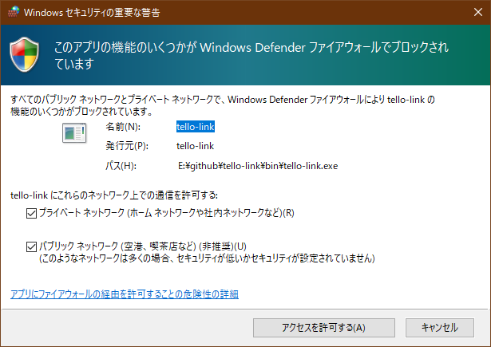

最初に起動したときWindows firewallの問い合わせが表示されるので、「パブリック ネットワーク」をチェックして「アクセスを許可する」ボタンをクリックします。

「パブリック ネットワーク」をチェックし忘れると Tello との受信ができません。

Tello からの受信ができないようならば、

1. Windows Defender ファイアウォールを開き
2. 受信の規則で tello-link のプロパティを開き
3. 詳細設定タブを開き
4. プロファイルの「パブリック」をチェックし
5. OKボタンで修正してください。

